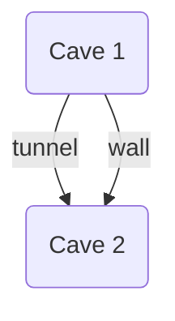

---
{"publish":true,"title":"Investigating the Cave In","modified":"2025-07-02T20:13:30.680-07:00","cssclasses":""}
---

# Investigating the Cave In

## Session 2

##### TLDR

- Bloo, Skaga, and Amoivada go down to investigate the cave in. Quill is caught leaving Seliph's attendant's house and is strongly convinced to come with. Seliph meets Marcan on the way to the mines, and together, the group explores the mines, clears rocks, slashes stalactites, saves miners, and cooks kalamari. Suddenly, there is a flash of purple light and...
- PCs Involved:
  - [[Characters/PCs/Bloo]]
  - [[Characters/PCs/Quill]]
  - [[Characters/PCs/Skaga]]
  - [[Characters/PCs/Amoiváda]]
  - [[Characters/NPCs/Marcan Beakoup]]
- Previous session: [[Session Notes - Reflections/01 - 10.21.2022 - Night Market]]

##### Important Points

- Quill accidentally broke into Seliph's attendant's room last night, and is now getting roped into the rescue mission
- Successfully saved the miners, who say the cave-in was caused by a weird blue and purple light
- While the party is resting and cooking kalamari, there is a flash of purple light

### 04.01.0347 Morning | The Tavern, [[Faltera/Fusilla/The Kingdom of Fusilla#Canonbury\|Canonbury, Fusilla]]

- [[Characters/NPCs/Seliph Orsterra]] goes downstairs, confused as to what to do, goes on ahead to the mines first
- Passes an Arrakocra (Marcan Beakoup)
  - Seliph: "Can you help me with smth, move some rocks?"
  - Arrakocra: "Ofc"
  - Seliph: "Long story short, rescue a cave in"
  - Arrakocra: "Okay kewl, I'll rescue 'minors'
  - Seliph: "Seems legit"
  - There are a lot of boulders to move
- Seliph's second in command goes around calling ppl up to go to mines, knocking on doors
- Trio of people (nervous eldritch cannon man, shorter capable woman, and a dude(?))
- Knocks on Skaga's door:
  - Skaga: "R u a fan"
  - 2nd in command: "A fan of your actions from last night, from kicking out the drunk dude. U coming?"
- Knocks on Bloo's door:
  - 2nd in command: "You coming?"
  - Bloo: "Yeh"
- Knocks on Amoivada's door:
  - 2nd in command: You coming?
  - Amoivada opens it and stares, "yeeeeesss"
- Seliph's attendant gathers everyone, marches to mines
  - "Path to mines are this way, should be relatively simple. Go closer to the mtn. Easy. Should be signs toward mines, crack of sunrise. If you get lost, perhaps you won't get paid. Don't get lost, we'll pay you at the end. Plz meet Seliph"
- As everyone goes, attendant goes to her house close to restaurant area, opens the door, goes into room

##### Seliph's Attendant and Quill

- Quill, still under the bed, hears footsteps and door opens
- Seliph's attendant goes upstairs, opens a wardrobe, clinking metal, hear a big thud as something slams down
  - Attendant: "Alright, let's hope I don't need to do this, too early for this"
  - Straps sword to her back
- Quill, who has woken up, unflatten, get out from under bed, leave out the window, go on merry way, climb down, just falls
- There's a shrub breaks the fall, and fall wasn't high enough
- As Quill fall, hear a door close, you're on the main street, hear footsteps
- Quill sinks into bushes, awkwardly fidgeting
- Forgets white robe in green shrub
- As footsteps get closer, Attendant: "Oh, are you ok"
- Quill: "Yeah"
- Attendant: "What r u doing in the bushes outside my house"
- Quill: "The bushes are comfy"
- She sees her open window, stares at Quill
- Quill: "IDK why the window is open"
- Attendant: "I could've sworn I closed it. What r u doing"
- Quill: "I'm hanging out in the bushes, it's not against the law"
- Attendant: "I'll give you one chance to answer honestly, did u climb in just now"
- Quill: "Well I mean, not now"
- Attendant: "I won't report you to guards if you come with me for no pay"
- Quill: "Are there ducks?"
- Attendant: "Possibly"
- Quill: "Great I'm in"
- Attendant: "Don't steal shit, If I catch you…" unsheathes sword
- Quill: "I've faced worse"
- Attendant is offended, "ppl's lives are at stake"

##### Mine Entrance

- Marcan & Seliph looking at entrance to mine
- Only see gigantic boulders, completely obstructed
  - Marcan: "Verily bestie"
  - Seliph: "Knew we should've gone last night, r u strong"
  - Marcan: "Yah"
  - Seliph: "You have 2 options, climb up mtn, go mine from upper entrance, OR if you can move rubble, we can get in at this floor, help save miners soon"
  - Marcan: "Later assistance is coming right?"
  - Seliph: "Yah, time is of the essence"
  - Marcan: "clear the path for later coming companions"
  - Marcan chooses to move middle bottom boulder, finds leverage, push boulder over and out, rest of the rocks were stacked on top of it, so some of the rocks slide forward, Seliph tries to hold them before they collapse
  - Marcan supports by pushing together, together push it back, rocks start to lock in place, looks scuffed, no longer moving
  - Seliph: "Maybe not best idea"
  - Marcan: "I think it's fine"
  - Seliph: "get rocks from top"
- Rest of ppl coming
  - 3 Seliph fanboys, 3 weirdos from crowd yesterday, and 3 weirdos in party
  - Seliph: "thank the gods"
- Amoivada: gives him a blob hand, big right hand, like the sticky slappy hands
- Seliph: "nice to meet you, could be useful I guess, moving rocks might be difficult"
  - Marcan: "only with that attitude"
  - Marcan pointing at fanboys: "These three look eager for labor"
  - They say yes
  - Seliph: "hm? You volunteered them, so you must have a plan"
  - Marcan: "We moved a boulder with 2ppl, 3 > 2, so we can do dis "
  - Seliph: "I trust your judgement (lol not rlly), some ppl need to learn to be a leader"
- 3 fanboys:
  - All 3 of them disregard instructions, each took 1 boulder for themselves, and pushed them, somehow clearing all the front boulders
    - "THIS IS FOR YOU SELIPH"
  - Now the back boulders shifting down
  - Seliph: "Wait look out"
    - Attempts to smash the boulder with iron greaves, successfully smashes it, saves a fanboy, some of the projectile hit fanboy in eyes
    - "THANK YOU SELIPH BUT AAAAHHH"
    - Marcan: "Be grateful that your last image was of your hero"
  - Seliph: "ok there r ppl in there, at least there's more clearance"
- There's a hole about crouch height, Seliph will go in first, "who's following?"
- Amoivada squiggles in, sees smaller opening to show off
- Skaga tries to fit into tiny hole, trying to do it cool, totally miss, bonk arm, now the rocks are starting to fall
- Bloo casts [[Magic Missile]] to save Skaga, the two uninjured fanboys get hit with shards and blinded
- 2nd in command drags the 3 fanboys away, Skaga, Bloo, and Quill can now just walk in without rocks falling
- We enter cave

##### Cave

- Seliph is walking forward, Bloo lights up torches at entrance with [[Prestidigitation]]
- Have an up and down staircase
- Seliph: "You're armed"
  - Marcan: "I have 2"
  - Amoivada: "I have 3" (creates a 3rd blob arm)
- Seliph goes down the staircase
- Marcan: "I want to go up, if someone joins me"
  - Bloo: You coward go alone
  - Skaga: going with Marcan
  - Bloo: goes with Skaga
  - Quill: goes away from traffic cone (Bloo)

##### Cave Up Staircase

- There is a tunnel
- Skaga sees that it's a tunnel for a really long distance
  - Wide enough for 2 ppl to walk side by side
  - No torches
  - Marcan goes back down
  - I cast [[Mage Hand]] + [[Light]] on rock, hold mage hand 25 ft. in front of me
  - Marcan comes back, Skaga and Bloo go down the tunnel
- Mage hand out of tunnel, see an underground room, I spread the light of mage hand
- See another tunnel diagonally left, dim light coming out of it
- See big pointy rocks on right (stalactite thing)
  - Marcan: "The formation of this cave cannot have caused the cave in down there, the cave in has to have been on purpose. Else, there is nothing."
  - Marcan walks in, whacks stalactite with halberd, clean chop, Bloo gets a small cone of stone, Marcan has a slightly larger one
- Nothing weird in room, other tunnel leads to upper entrance that Seliph was talking about
- So we all just walk back

##### Cave Down Staircase 1 (simultaneous to Up)

- Air gets thicker, coal dust in air, opens into cave large
- Amoivada and Quill go down, can't see Seliph who has gone on ahead
- Sound comes from distance, too far to see, hears like air whistling/whooshing
- Quill can echolocate with her quacksilver blade
  - Swings sword toward sound, gauge that it can't be too much further then what you can see
- Amoivada casts Create Bonfire to see
  - More rocks in front, see tunnel going right
  - The wall is thin, so sound
- Quill and Amoivada try to chip at the wall, 1 with quacksilver blade, other with druidic focus (a wooden bird head)
  - The quacksilver blade doesn't do much, the druidic focus cracks the wall
  - Quill hits again
- Start hearing voices, can't distinguish anything
- While Quill and Amoivada break the wall, Marcan Skaga Bloo catches up
- Crack wall
- Seliph: "is that you guys, I need a hand"
  - Bloo sends mage hand through the wall
  - Seliph: "You think you're funny"
- Seliph: "The ppl are over here, can you help me clear the rubble"
- Marcan: "Yo bro, the cave in might've been intentional"
  - Seliph: "Oh right yeah whatever, there's tremors here, the ppl are a priority"
- Quill: "are there ducks"
  - Seliph: "THERE ARE NO DUCKS"
  - Quill just leaves
- Amoivada goes through hole in wall
- Skaga goes through, Bloo goes through
- Opens into cave, tunnel on right from the other tunnel

- Seliph next to rubble, 2 people, "Still conscious, but weak, anyone have healing magic?"
- Amoivada casts Cure Wound, can only heal 1 person
  - Pink: younger man, half elf dressed in miner's garb, hat/helmet
  - Yellow: older man, Yellow's mentor/supervisor
  - Picks younger one to heal
- Marcan: stands intimidatingly in front of younger man, who is trembling in fear
  - Marcan: "Will you answer my question?"
  - Unintelligible gibberish in fear
  - Seliph: "Alright young man, do you know what is cause of cave-in?"
  - Marcan: "Smth like that"
  - Young man: "Weird blue light that just, blue and purple, dunno what happened, suddenly, the rocks came crashing in and IDK what happened, not even a tremor has done this before"
  - Seliph helps older man and younger man out, "you 4 go down and check"
  - Tell Seliph that Quill left

##### Quill

- Aboveground, on the way out
- Hear clacking, the attendant is walking back
  - Attendant: "Oh, I take it that everything is cleared up"
  - Quill: "I think so, they're getting the people out"
  - Attendant: "Is that everyone?"
  - Quill: "I think so"
  - Attendant: "Is Seliph coming out now?"
  - Quill: "He'll come out eventually"
  - Attendant: "What happened"
  - Quill: "They found the ppl, I don't have to be there, there were no ducks"
  - Attendant: "Why ducks"
  - Quill: "Why not ducks"
  - Attendant: "I'm gonna have a chat with Seliph about how I found you"
  - Quill: "Maybe I should go back in"
- Seliph walks out w/others, "oh yes you in the robe, your services are still requested"
- So Seliph, attendant, and miners leave area, Quill heads back

##### Cave Down Staircase 2

- Rocks piled up so can just climb over
- Move rocks from top
- Marcan flies over
- Bloo furiously climbs over the rocks (NAT 20 LMAO)
- Quill has returned
- Amoivada is squeezing through cracks again
  - It just doesn't work
- On other side of pile of rocks, see torch that looks like a normal torch, not wood, has a faint glowy outline
- Also see giant wooden door (it has no crack, no door handle, literally wooden wall in shape of door)
- Bloo attempts to light the torch with [[Prestidigitation]], which just makes light around it, it just burns out, it doesn't stay lit
- Amoivada tries to climb over
- Skaga climbs over successfully
- Quill and Amoivada can't get a good grip and keep falling
- Bloo throws rope down, give rope to Marcan, who pulls Quill up
- Amoivada, blob on rope, gets pulled up by Marcan
- Marcan knocks on the door
  - Nothing
- Bloo uses mage hand to pull the torch, it's a lever (ofc it is)
- The wooden wall goes down into the wall, stone is shaped like door
- Bloo sends mage hand light forward, see more stalactites
- Tunnel at 90 degree turn, at the end of the wall that faces us, there is area on wall where light is shinier on that rock, unnatural, area that shines / reflects light differently
- Marcan slashes at stalactite, when a dark mantle drops from ceiling, latches onto Marcan's head, who can no longer see, hear, or breath
  - FIGHT STARTS HYPE
  - Marcan swings halberd right above his head, but misses and strikes a pose
  - Dark mantle tries to crush Marcan's head
  - Quill goes closer, and takes quacksilver blade, misses entirely
  - Skaga: "you know his head is in there, Quill" "I was aiming above it" "uh huh"
    - Try to peel the tentacles off with hands
    - Yank the tentacles off so Marcan can breath, throw it somewhere, it floats around
  - Amoivada: light crossbow shot misses
  - Bloo: Mind slivers it
  - Marcan: swings halberd at it, looks hurt, still floating
    - Flexes with the halberd
  - Dark mantle: tries to latch onto Skaga's head, fails, Skaga fends it off
  - Quill: **SNEAK ATTACK** hits
  - Skaga: rolls to catch it (nat 20) out of the air by flipping over it and catching it midair, and now it's grappled, slice with greatsword, and it splits in half, and then starts shriveling, plop
  - ENEMY DEFEATED +1 confidence
- Marcan rolls to slash stalactite, Skaga now has "Cone of Stone Slightly Large"
- Amoivada does create bonfire and make kalamari with stake from Quill
  - Severely overcook it
  - Bloo cast Prestidigitation on it to make it taste better and edible
  - Split into 3 for Marcan, Quill, and Skaga
- See purple glow from end of cave we didn't come from
- CLIFFHANGER >:(
